# mandou-bem-web

# Instruções
## Requisitos

- NodeJS
- Yarn

## Instalar dependências

`yarn`

## Executar aplicação

`yarn start`

# [OK] Requisitos Módulo 1
## [OK] Criar conta

**RF**

- O usuário deve criar sua conta informando o nome da empresa, nome completo, e-mail e senha;

**RN**

- O usuário não pode cadastrar uma conta com o e-mail de um usuário já cadastrado;
- O usuário precisa confirmar a senha ao criar a conta;

## [OK] Login

**RF**
- O usuário deve acessar o sistema usando seu e-mail e senha válidos;

**RNF**

- A autenticação deve acontecer usando JWT;

**RN**

- Caso o e-mail ou a senha sejam inválidos, informar um erro genérico para dificultar ataques;

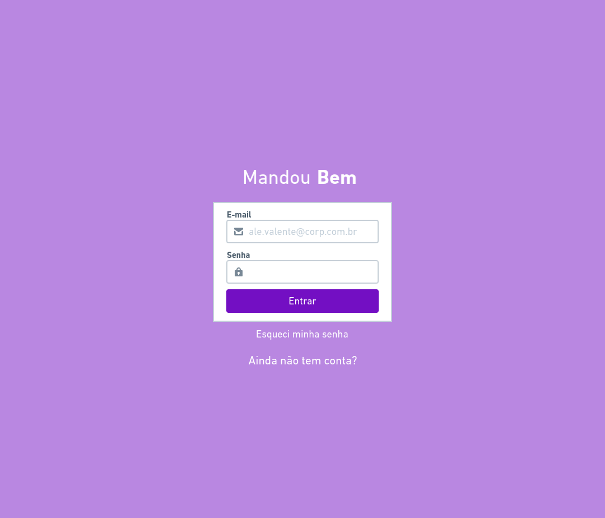

## [OK] Manter usuários

**RF**

- O usuário admin deve poder criar, listar e excluir colaboradores;
- Para adicionar um colaborador é preciso informar o nome completo e e-mail do mesmo;
- Os colaboradores adicionados devem receber um e-mail com sua senha;

**RNF**

- Utilizar Ethereal para testar envios em ambiente de dev;
- O envio de e-mails deve acontecer em segundo plano (background job);

**RN**

- As senhas enviadas por e-mail devem ser randômicas;
- O usuário admin não pode adicionar um colaborador com o e-mail de um usuário já cadastrado;

[OK]
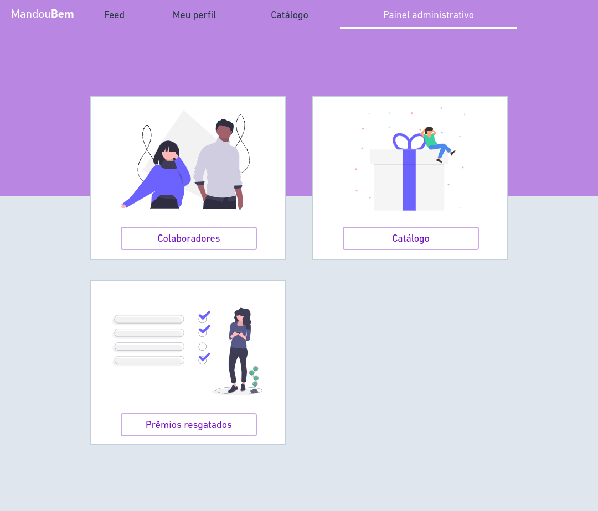
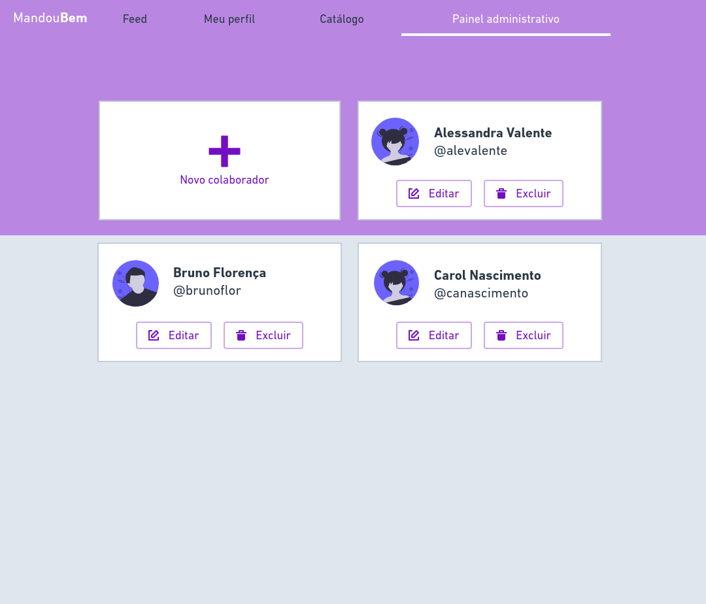
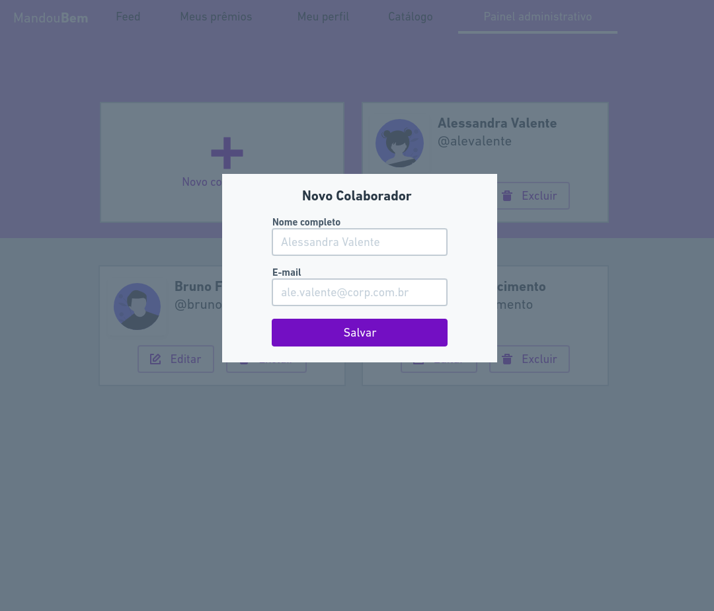

## [OK] Manter perfil

**RF**

- O usuário deve poder atualizar seu nome, e-mail e senha;
- O usuário deve poder atualizar seu avatar fazendo o upload de uma imagem;

**RNF**

- O avatar deve ser armazenado usando o [Cloudinary](https://medium.com/@joeokpus/uploading-images-to-cloudinary-using-multer-and-expressjs-f0b9a4e14c54);

**RN**

- O usuário não pode alterar seu e-mail para um e-mail já utilizado;
- Para atualizar sua senha, o usuário deve informar a senha antiga;
- Para atualizar sua senha, o usuário precisa confirmar sua senha;

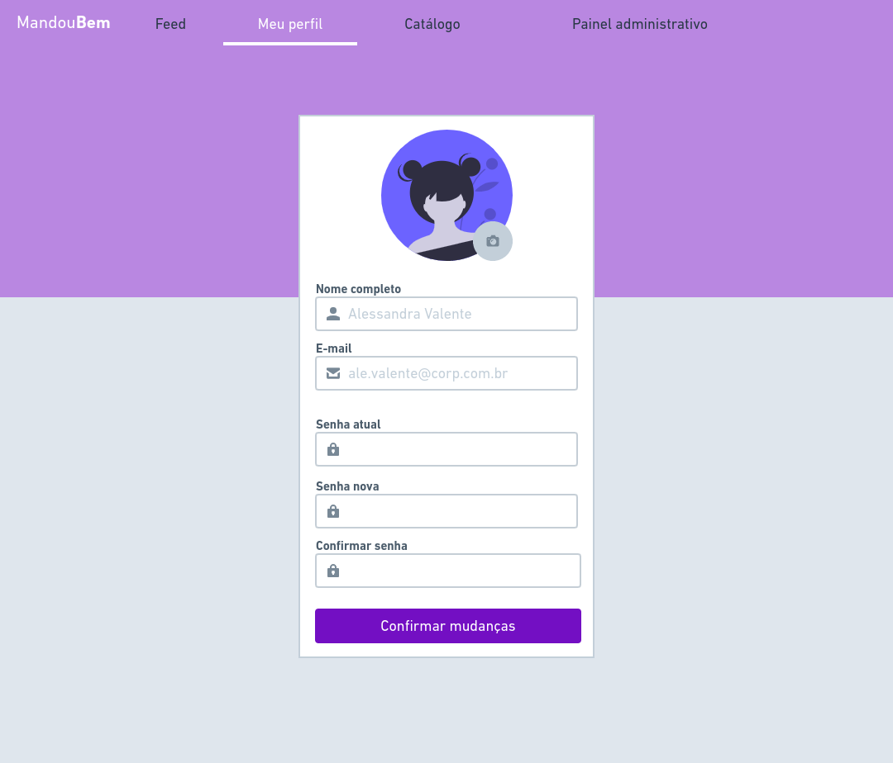

##  [OK] Recuperar senha

**RF**

- O usuário deve recuperar sua senha informando o seu e-mail;
- O usuário deve receber um e-mail com instruções de recuperação de senha;
- O usuário deve poder resetar sua senha;

**RNF**

- Utilizar Ethereal para testar envios em ambiente de dev;
- O envio de e-mails deve acontecer em segundo plano (background job);

**RN**

- O link enviado por e-mail para resetar senhas deve expirar em 2h;
- O usuário precisa confirmar a nova senha ao resetar sua senha;

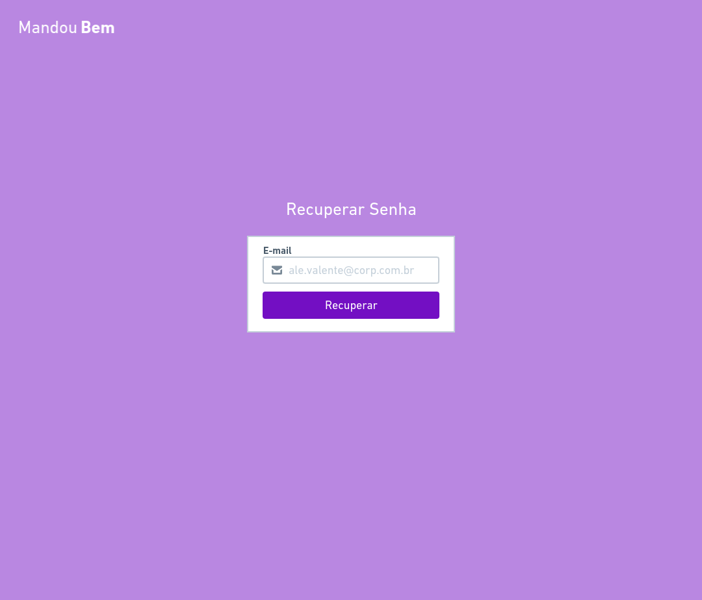
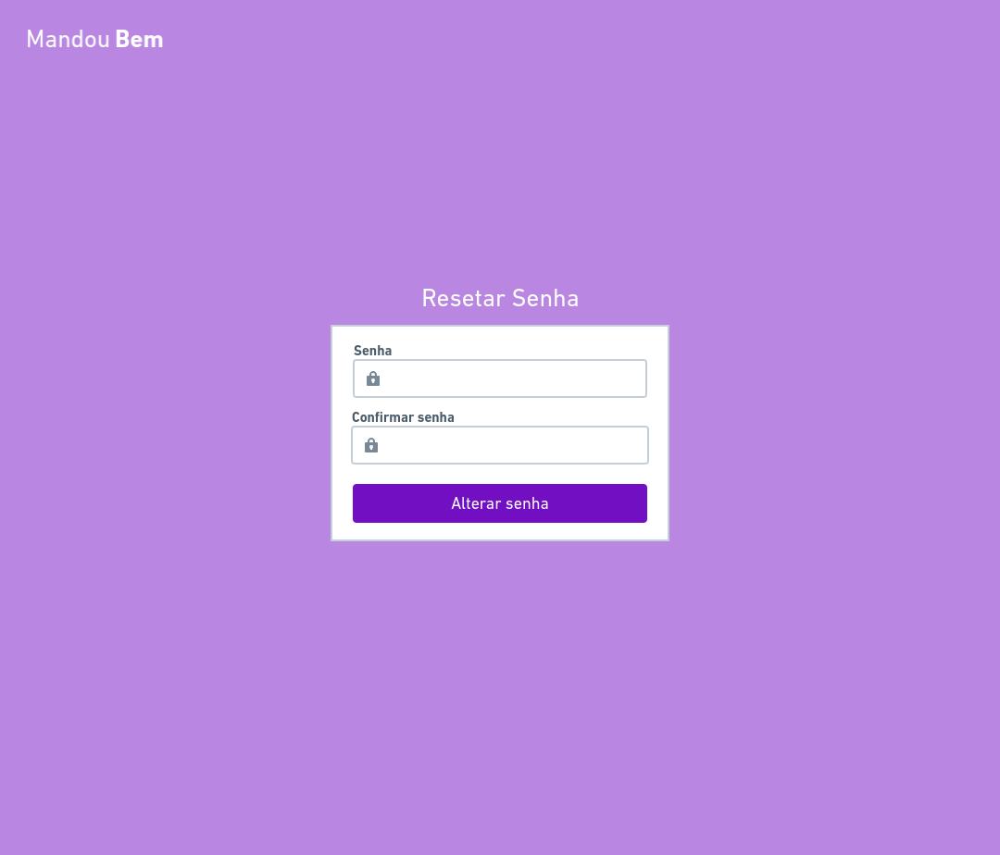

# [OK] Requisitos Módulo 2

## [OK] Catálogo de prêmios

**RF**

- O usuário admin deve poder criar, alterar, listar e excluir prêmios do catálogo;
- Para adicionar um prêmio é preciso informar o título, link da imagem e a quantidade de pontos;

**RN**

- Não pode ser possível adicionar um prêmio com o nome de um prêmio já cadastrado na empresa;
- Não pode ser possível adicionar um prêmio com pontos negativos

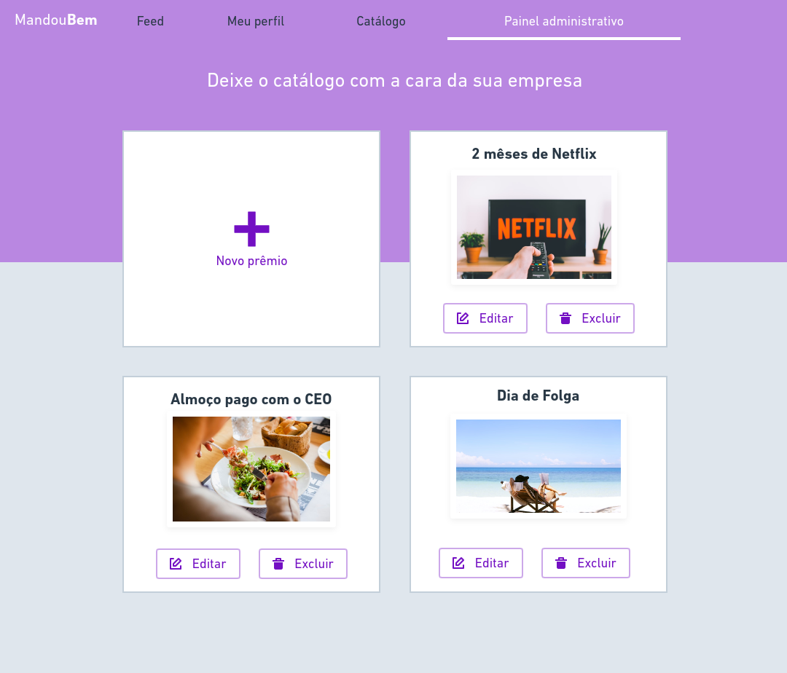
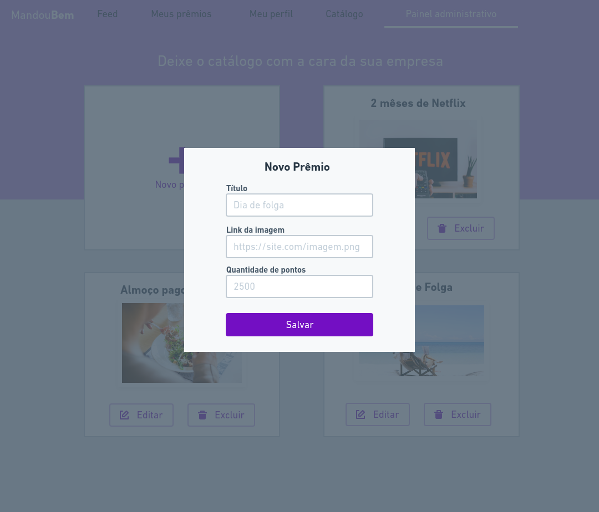

## [OK] Resgate de prêmio

**RF**

- O usuário deve poder resgatar um prêmio do catálogo de sua empresa;

**RN**

- O usuário só pode resgatar prêmios que tenha quantidade de pontos igual ou menor que a quantidade de pontos recebidos;
- A quantidade de pontos do prêmio deve ser subtraída do total de pontos recebidos pelo usuário;
- Não pode ser possível resgatar o prêmio que não existe na empresa

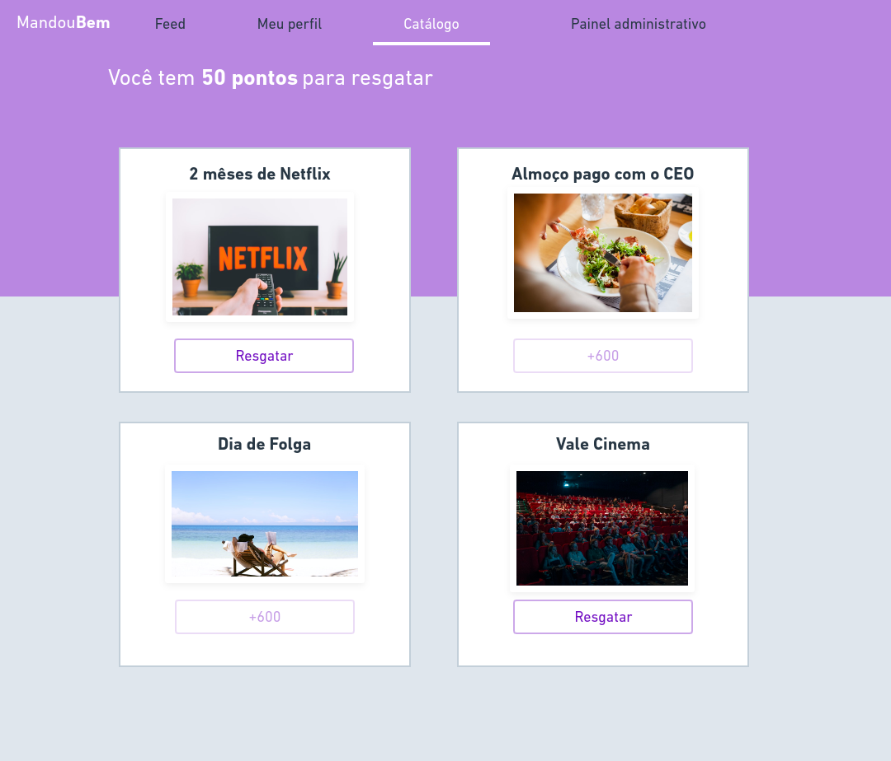

## [OK] Entrega de prêmio

**RF**

- O usuário admin deve listar os resgates de prêmio;
- O usuário admin deve poder marcar um resgate de prêmio como entregue;

**RN**

- Resgates de prêmios marcados como entregues não devem aparecer na listagem do admin;

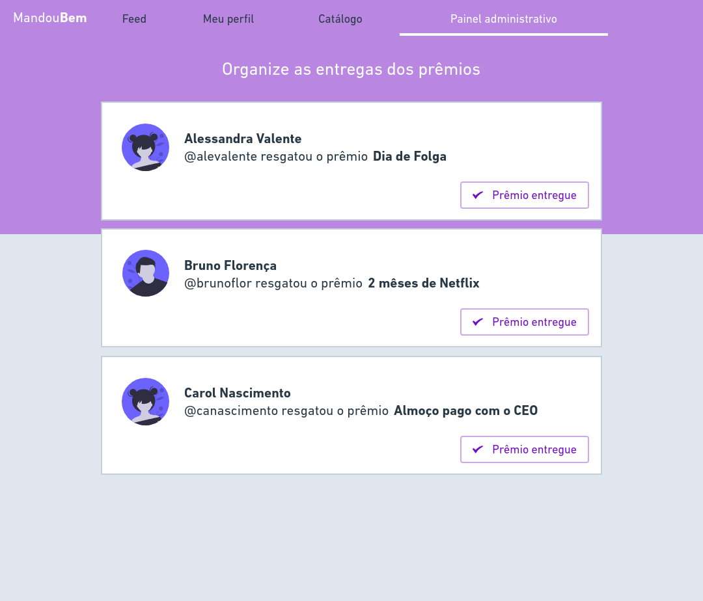

#  Requisitos Módulo 3

## Postagens de reconhecimento

**RF**

- [OK] Ao digitar o símbolo "@" deve aparecer um *autocomplete* com os colaboradores da empresa que deve ser interrompido ao pressionar a tecla "espaço";
- [OK] O usuário deve poder criar uma postagem de reconhecimento para um colega;
- [OK] Para criar a postagem o usuário precisa informar o colaborador, a quantidade de pontos e uma mensagem;
- [OK] O usuário deve poder criar um comentário em uma postagem de reconhecimento;
- (Pouco prioritário) O usuário deve ser capaz de enviar imagens e gifs na postagem;

**RNF**

- As postagens devem ser armazenadas no MongoDB;
-  A listagem das postagens deve ser armazenado em cache (Redis);

**RN**

-  O usuário não pode criar uma postagem de reconhecimento para ele mesmo;
-  O usuário pode criar uma postagem de reconhecimento com uma quantidade de pontos igual ou menor ao seu total disponível;
-  Os pontos enviados na postagem devem ser subtraídos dos pontos disponíveis para enviar do usuário que criou a postagem;
-  Os pontos enviados na postagem devem ser adicionados nos pontos recebidos pelo usuário reconhecido na postagem;

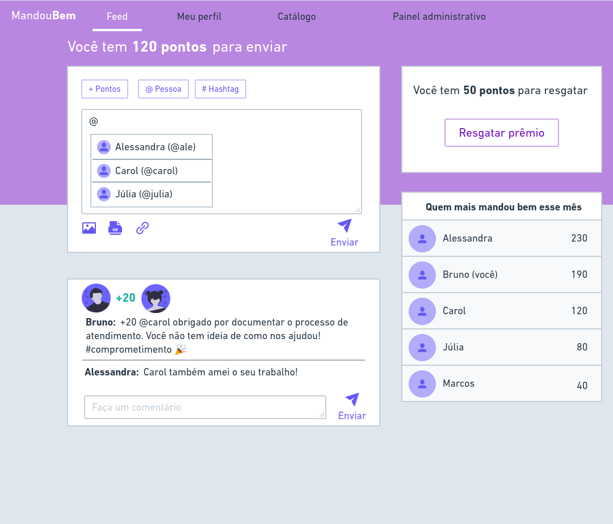

## Ranking dos ganhadores de pontos

**RF**

- O usuário deve poder ver um ranking com os colaboradores de sua empresa que mais receberam pontos naquele mês;

**RNF**

- A listagem do ranking deve ser armazenada em cache (Redis);

## [OK] Pontos restantes para enviar

**RF**

- O usuário deve poder ver a quantidade de pontos restantes para ele enviar para seus colegas;

**RNF**

- A quantidade de pontos restantes para enviar deve ser armazenada em cache;

**RN**

- A quantidade de pontos restantes para enviar deve ser calculada subtraindo de 100 a quantidade de pontos já enviados no mês atual, ou seja
todo mês o usuário terá 100 pontos disponíveis para serem enviados para seus colegas;

# Próximos passos

- Deploy no Netlify
